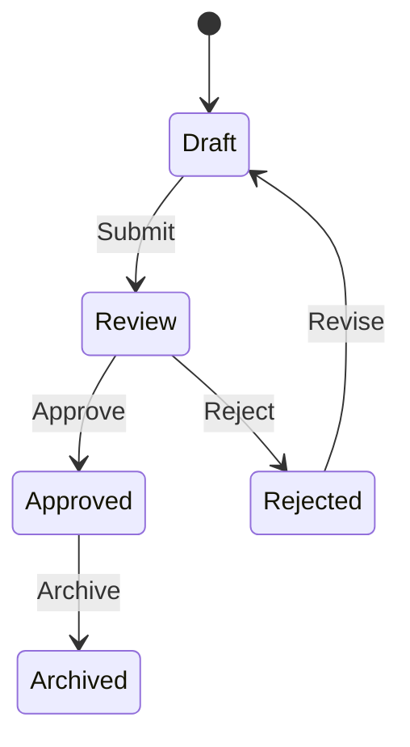

# Key Workflow Features Demonstrated

## **State Transitions**

```typescript
docWorkflow.load({
  transitions: [
    { from: "Draft", to: "Review", on: "Submit", ... }
  ]
});
```

## **Audit History**

```typescript
doc.history.push({
  from: "Draft",
  to: "Review",
  at: new Date(),
  by: "user@company.com",
  comments: "Initial submission"
});
```

## **Task Assignment**

```typescript
const task = docWorkflow.getTaskForTransition(event, doc.state);
sendEmail(task.assign, task.message);
```

## **Transition Validation**

```typescript
if (!docWorkflow.canTransition(event, doc.state)) {
  return ctx.respond({ error: "Invalid transition" });
}
```

## **HATEOAS Navigation**

```typescript
ctx.respond(..., {
  links: {
    history: `/documents/${doc.id}/history`,
    revert: `/documents/${doc.id}/revert`
  }
});
```

## Example API Interactions

### **Create Document**

```bash
curl -X POST http://localhost:3000/documents \
  -H "Content-Type: application/json" \
  -d '{
    "title": "Project Proposal",
    "content": "...",
    "author": "author@company.com"
  }'
```

### **Submit for Review**

```bash
curl -X POST http://localhost:3000/documents/{id}/transitions \
  -H "Content-Type: application/json" \
  -d '{
    "event": "Submit",
    "user": "author@company.com"
  }'
```

### **Approve Document**

```bash
curl -X POST http://localhost:3000/documents/{id}/transitions \
  -H "Content-Type: application/json" \
  -d '{
    "event": "Approve",
    "user": "reviewer@company.com",
    "comments": "Looks good!"
  }'
```

### **Get Document State**

```bash
curl http://localhost:3000/documents/{id}
```

### **View Transition History**

```bash
curl http://localhost:3000/documents/{id}/history
```

## Workflow Visualization



This implementation shows:

- Full state machine implementation
- Audit trail with user attribution
- Automatic email notifications
- Transition validation
- HATEOAS navigation
- Historical tracking
- Type-safe event handling

The workflow can be extended with:

- Role-based access control
- Approval chains
- SLAs for state transitions
- Versioned document states
- PDF report generation on approval
- Integration with cloud storage
