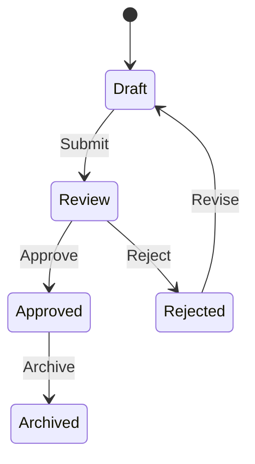

# Mix Framework Workflow Example

This example demonstrates Mix's content negotiation capabilities and HTMX integration in a single-page application, along with workflow state management features.

## Running the Example

You can run this example using Deno tasks:

```bash
# Run the workflow example
deno task workflow

# Run with file watching (auto-reload on changes)
deno task workflow:watch
```

Then open your browser to [http://localhost:3000](http://localhost:3000) to see the application.

## New Features

- **Content Negotiation**: Serve JSON, HAL, and HTML from the same endpoints
- **HTMX Integration**: Dynamic content swapping without JavaScript
- **Interactive UI**: Search, sorting, and dynamic updates
- **Single-Page Application**: Navigation without page reloads
- **Responsive Design**: Works on mobile and desktop

## Content Sections

1. **Home**: Overview of the application
2. **Products**: Interactive product catalog with search and sorting
3. **Features**: Showcase of HTMX capabilities
4. **API Formats**: Examples of different response formats
5. **Error Demo**: Demonstration of error handling

## HTMX Features Demonstrated

- Content swapping with `hx-get` and `hx-target`
- Form submission with `hx-post`
- Search with debounce using `hx-trigger="keyup changed delay:500ms"`
- Loading indicators with `hx-indicator`
- Lazy loading with `hx-trigger="load"`
- Polling with `hx-trigger="load, every 2s"`

## Key Workflow Features Demonstrated

## **State Transitions**

```typescript
docWorkflow.load({
  transitions: [
    { from: "Draft", to: "Review", on: "Submit", ... }
  ]
});
```

## **Audit History**

```typescript
doc.history.push({
  from: "Draft",
  to: "Review",
  at: new Date(),
  by: "user@company.com",
  comments: "Initial submission"
});
```

## **Task Assignment**

```typescript
const task = docWorkflow.getTaskForTransition(event, doc.state);
sendEmail(task.assign, task.message);
```

## **Transition Validation**

```typescript
if (!docWorkflow.canTransition(event, doc.state)) {
  return ctx.respond({ error: "Invalid transition" });
}
```

## **HATEOAS Navigation**

```typescript
ctx.respond(..., {
  links: {
    history: `/documents/${doc.id}/history`,
    revert: `/documents/${doc.id}/revert`
  }
});
```

## Example API Interactions

### **Create Document**

```bash
curl -X POST http://localhost:3000/documents \
  -H "Content-Type: application/json" \
  -d '{
    "title": "Project Proposal",
    "content": "...",
    "author": "author@company.com"
  }'
```

### **Submit for Review**

```bash
curl -X POST http://localhost:3000/documents/{id}/transitions \
  -H "Content-Type: application/json" \
  -d '{
    "event": "Submit",
    "user": "author@company.com"
  }'
```

### **Approve Document**

```bash
curl -X POST http://localhost:3000/documents/{id}/transitions \
  -H "Content-Type: application/json" \
  -d '{
    "event": "Approve",
    "user": "reviewer@company.com",
    "comments": "Looks good!"
  }'
```

### **Get Document State**

```bash
curl http://localhost:3000/documents/{id}
```

### **View Transition History**

```bash
curl http://localhost:3000/documents/{id}/history
```

## Workflow Visualization



This implementation shows:

- Full state machine implementation
- Audit trail with user attribution
- Automatic email notifications
- Transition validation
- HATEOAS navigation
- Historical tracking
- Type-safe event handling

The workflow can be extended with:

- Role-based access control
- Approval chains
- SLAs for state transitions
- Versioned document states
- PDF report generation on approval
- Integration with cloud storage
