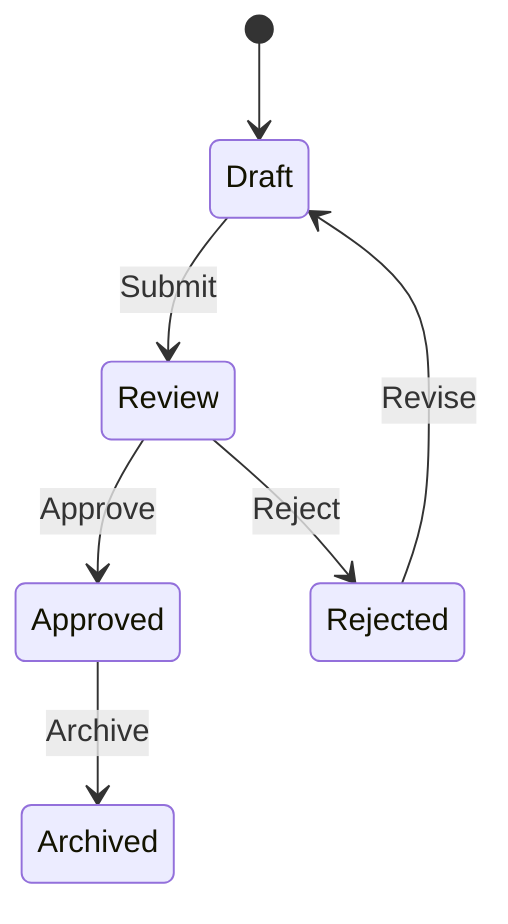

# Mixon Framework Workflow Example with HATEOAS Support

This Shopping Cart example demonstrates Mixon's advanced REST API capabilities including:

- **HATEOAS** (Hypermedia as the Engine of Application State)
- **Content Negotiation** with multiple media types (JSON, HAL+JSON, HTML)
- **HTMX Integration** for dynamic client-side interactions
- **Workflow State Management** with a full state machine implementation

Unlike the Product Catalog example (which focuses on basic CRUD operations), this example showcases how to build a hypermedia-driven API that follows REST architectural constraints more completely.

## Running the Example

You can run this example using Deno tasks:

```bash
# Run the workflow example
deno task workflow

# Run with file watching (auto-reload on changes)
deno task workflow:watch
```

Then open your browser to [http://localhost:3000](http://localhost:3000) to see the application.

## Advanced REST API Features

### HATEOAS Implementation

- **Hypermedia Controls**: API responses include links to related resources and available actions
- **Resource Discovery**: Clients can navigate the API without prior knowledge of endpoints
- **State Transitions**: Available actions are presented based on the current state
- **Self-Documenting API**: Responses include metadata about what actions are possible

### Content Negotiation

- **Multiple Media Types**: Supports JSON, HAL+JSON, and HTML from the same endpoints
- **Accept Header Processing**: Automatically selects the appropriate representation based on the client's Accept header
- **HAL Format**: Hypermedia Application Language format for machine clients
- **HTML Format**: Rich HTML responses for browser clients

### Client Integration

- **HTMX Integration**: Dynamic content swapping without writing JavaScript
- **Nano JSX**: Server-side rendering with JSX components
- **Interactive UI**: Search, sorting, and dynamic updates
- **Single-Page Application**: Navigation without page reloads
- **Responsive Design**: Works on mobile and desktop

## Content Sections

1. **Home**: Overview of the application
2. **Products**: Interactive product catalog with search and sorting
3. **Features**: Showcase of HTMX capabilities
4. **API Formats**: Examples of different response formats
5. **Error Demo**: Demonstration of error handling

## HTMX Features Demonstrated

- Content swapping with `hx-get` and `hx-target`
- Form submission with `hx-post`
- Search with debounce using `hx-trigger="keyup changed delay:500ms"`
- Loading indicators with `hx-indicator`
- Lazy loading with `hx-trigger="load"`
- Polling with `hx-trigger="load, every 2s"`

## Component Structure

The UI is built with reusable components:

- `Layout`: Main page layout with navigation and content area
- `Home`: Home page content
- `ProductList`: Product catalog with search and sorting
- `ProductCard`: Individual product card component
- `ProductDetail`: Detailed product view
- `Features`: HTMX features showcase
- `FeatureCard`: Individual feature card component
- `ApiFormats`: API format examples
- `ErrorDemo`: Error handling demonstration

## Key Workflow Features Demonstrated

## **State Transitions**

```typescript
docWorkflow.load({
  transitions: [
    { from: "Draft", to: "Review", on: "Submit", ... }
  ]
});
```

## **Audit History**

```typescript
doc.history.push({
  from: "Draft",
  to: "Review",
  at: new Date(),
  by: "user@company.com",
  comments: "Initial submission"
});
```

## **Task Assignment**

```typescript
const task = docWorkflow.getTaskForTransition(event, doc.state);
sendEmail(task.assign, task.message);
```

## **Transition Validation**

```typescript
if (!docWorkflow.canTransition(event, doc.state)) {
  return ctx.respond({ error: "Invalid transition" });
}
```

## **HATEOAS Implementation Details**

### Link Generation

```typescript
// Using the createLinks utility to generate hypermedia controls
const links = createLinks({
  self: `/documents/${doc.id}`,
  history: `/documents/${doc.id}/history`,
  revert: `/documents/${doc.id}/revert`,
  // Only include transition links for valid state transitions
  ...(canApprove ? { approve: `/documents/${doc.id}/approve` } : {}),
  ...(canReject ? { reject: `/documents/${doc.id}/reject` } : {})
});

// Include links in the response
ctx.response = createResponse(ctx, document, { links });
```

### HAL+JSON Response Example

```json
{
  "id": "doc-123",
  "title": "Project Proposal",
  "state": "Review",
  "content": "...",
  "_links": {
    "self": { "href": "/documents/doc-123" },
    "history": { "href": "/documents/doc-123/history" },
    "approve": { "href": "/documents/doc-123/approve" },
    "reject": { "href": "/documents/doc-123/reject" }
  }
}
```

### Content Negotiation Implementation

```typescript
// Parse Accept header for content negotiation
const acceptHeader = request.headers.get('Accept');
const preferredMediaType = parseAcceptHeader(acceptHeader);

// Return response in the preferred format
return match({ mediaType: preferredMediaType })
  .with({ mediaType: MediaType.HAL }, () => {
    // Return HAL+JSON format with _links
    return new Response(JSON.stringify({
      ...document,
      _links: links
    }), {
      headers: { "Content-Type": MediaType.HAL }
    });
  })
  .with({ mediaType: MediaType.JSON }, () => {
    // Return plain JSON format
    return new Response(JSON.stringify(document), {
      headers: { "Content-Type": MediaType.JSON }
    });
  })
  .with({ mediaType: MediaType.HTML }, () => {
    // Return HTML format using JSX components
    return new Response(renderSSR(
      <DocumentDetail document={document} links={links} />
    ), {
      headers: { "Content-Type": MediaType.HTML }
    });
  })
  .otherwise(() => {
    // Default to JSON if no match
    return new Response(JSON.stringify(document), {
      headers: { "Content-Type": MediaType.JSON }
    });
  });
```

## Example API Interactions with Content Negotiation

### **Get Products with Different Media Types**

#### JSON Format

```bash
curl http://localhost:3000/api/products \
  -H "Accept: application/json"
```

Response:

```json
{
  "products": [
    { "id": "p001", "name": "Wireless Mouse", "price": 29.99, ... },
    { "id": "p002", "name": "Mechanical Keyboard", "price": 89.99, ... }
  ]
}
```

#### HAL+JSON Format

```bash
curl http://localhost:3000/api/products \
  -H "Accept: application/hal+json"
```

Response:

```json
{
  "products": [
    { "id": "p001", "name": "Wireless Mouse", "price": 29.99, ... },
    { "id": "p002", "name": "Mechanical Keyboard", "price": 89.99, ... }
  ],
  "_links": {
    "self": { "href": "/api/products" },
    "search": { "href": "/api/products/search" },
    "categories": { "href": "/api/products/categories" }
  }
}
```

#### HTML Format

```bash
curl http://localhost:3000/api/products \
  -H "Accept: text/html"
```

Response: *HTML content for browser rendering*

### Following HATEOAS Links

#### Step 1: Get Product Details with Links

```bash
curl http://localhost:3000/api/products/p001 \
  -H "Accept: application/hal+json"
```

Response:

```json
{
  "id": "p001",
  "name": "Wireless Mouse",
  "price": 29.99,
  "description": "Ergonomic wireless mouse with long battery life",
  "category": "electronics",
  "_links": {
    "self": { "href": "/api/products/p001" },
    "add-to-cart": { "href": "/api/cart/add" },
    "category": { "href": "/api/products?category=electronics" },
    "related": { "href": "/api/products/related/p001" }
  }
}
```

#### Step 2: Follow the Category Link

```bash
curl http://localhost:3000/api/products?category=electronics \
  -H "Accept: application/hal+json"
```

#### Step 3: Add to Cart Using the Link

```bash
curl -X POST http://localhost:3000/api/cart/add \
  -H "Content-Type: application/json" \
  -d '{
    "productId": "p001",
    "quantity": 1
  }'
```

### Workflow State Transitions

#### Step 1: Get Order with Available Actions

```bash
curl http://localhost:3000/api/orders/o123 \
  -H "Accept: application/hal+json"
```

Response:

```json
{
  "id": "o123",
  "status": "pending",
  "items": [...],
  "total": 119.98,
  "_links": {
    "self": { "href": "/api/orders/o123" },
    "cancel": { "href": "/api/orders/o123/cancel" },
    "pay": { "href": "/api/orders/o123/pay" }
  }
}
```

#### Step 2: Pay for the Order Using the Link

```bash
curl -X POST http://localhost:3000/api/orders/o123/pay \
  -H "Content-Type: application/json" \
  -d '{
    "paymentMethod": "credit_card",
    "cardNumber": "4111111111111111",
    "expiryDate": "12/25",
    "cvv": "123"
  }'
```

#### Step 3: Get Updated Order State

```bash
curl http://localhost:3000/api/orders/o123 \
  -H "Accept: application/hal+json"
```

Response:

```json
{
  "id": "o123",
  "status": "paid",
  "items": [...],
  "total": 119.98,
  "_links": {
    "self": { "href": "/api/orders/o123" },
    "receipt": { "href": "/api/orders/o123/receipt" },
    "shipping": { "href": "/api/orders/o123/shipping" }
  }
}
```

**Notice how the available actions (links) change based on the order state.** This is a key aspect of HATEOAS - the server guides the client through the application by providing relevant links based on the current state.

## Workflow Visualization



## Key REST API Principles Demonstrated

### HATEOAS Implementation Details

- **Dynamic Navigation Links**: API responses include links that change based on resource state
- **Self-Documenting API**: Clients can discover available actions from the API itself
- **Decoupled Client-Server**: Clients don't need to hardcode URL patterns or state transitions
- **State-Driven Interactions**: Available actions are determined by the current state of resources

### Content Negotiation Benefits

- **Multiple Representations**: Same resources available in different formats (JSON, HAL+JSON, HTML)
- **Client Preference**: Server respects the client's preferred format via Accept headers
- **Progressive Enhancement**: HTML responses include HTMX attributes for enhanced browser experience
- **Format-Specific Features**: HAL+JSON includes hypermedia controls, HTML includes UI components

### Workflow State Management

- **Full State Machine Implementation**: Formal definition of states, events, and transitions
- **Audit Trail**: Complete history of state changes with user attribution
- **Transition Validation**: Ensures only valid state transitions are allowed
- **Type-Safe Event Handling**: Strong typing for workflow events and states

## Benefits of This Approach

- **Evolvable API**: Server can change implementation details without breaking clients
- **Discoverable Functionality**: Clients can learn about API capabilities at runtime
- **Reduced Client Complexity**: Clients don't need to implement complex state management
- **Consistent Error Handling**: Standardized error responses across all endpoints
- **Improved Developer Experience**: Clear separation of concerns between client and server

This example demonstrates how to build truly RESTful APIs that go beyond simple CRUD operations to embrace the full power of the REST architectural style, including the often-overlooked HATEOAS constraint.
